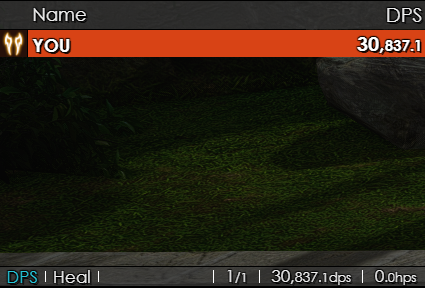

# How to Implement Custom `kagerou.css` into FFXIV ACT Kagerou Plugin

This guide will walk you through the steps to apply a custom `kagerou.css` file to the Kagerou overlay in the Advanced Combat Tracker (ACT) for Final Fantasy XIV.



---

## Easy Install

Copy the following into your Import/Export settings: ⇅

```Text
eyJkIjp7InN0eWxlIjp7ImJvZHktZm9udCI6IkNlbnR1cnkgR290aGljIiwiaGVhZGVyLWJnIjoicmdiYSgwLCAwLCAwLCAwLjgpIiwiY29udGVudC1iZyI6InJnYmEoMCwgMCwgMCwgMC44KSIsImNvbnRlbnQtYmctY29sb3IiOiJyZ2JhKDAsIDAsIDAsIDApIiwiY2VsbC1iZyI6InJnYmEoMjU1LCAyNTUsIDI1NSwgMC4zKSIsIm15LXJvdy1mZyI6InJnYmEoMjU1LCAyNTUsIDI1NSwgMSkiLCJjb250ZW50LWFsaWduIjoicmlnaHQiLCJzaGFkb3ctY2FyZCI6IjFweCAxcHggMCAjMDAwLCAtMXB4IC0xcHggMCAjMDAwLCAxcHggLTFweCAwICMwMDAsIC0xcHggMXB4IDAgIzAwMCwgMXB4IDFweCAwICMwMDAiLCJzaGFkb3ctdGV4dCI6IjFweCAxcHggMXB4IHJnYmEoMCwgMCwgMCwgMC44KSwgLTFweCAtMXB4IDFweCByZ2JhKDAsIDAsIDAsIDAuOCksIC0xcHggMXB4IDFweCByZ2JhKDAsIDAsIDAsIDAuOCksIDFweCAtMXB4IDFweCByZ2JhKDAsIDAsIDAsIDAuOCksIDJweCAycHggMHB4IHJnYmEoMCwgMCwgMCwgMC44KSIsImdhdWdlLWhlaWdodCI6Ijk1JSIsImdyYXBoLWhlaWdodCI6IjJyZW0ifSwiY29sb3IiOnsiZ2F1Z2UtZGVmYXVsdCI6ImxpbmVhci1ncmFkaWVudCh0byByaWdodCwgcmdiYSgwLCAwLCAwLDAuOCksIHJnYmEoMCwgMCwgMCwwLjUpKSIsInBsZCI6InJnYigxNjgsIDIxMCwgMjMwKSIsIndhciI6InJnYigyMDcsIDM4LCAzMykiLCJkcmsiOiJyZ2IoMjA5LCAzOCwgMjA0KSIsImduYiI6InJnYigxMjEsIDEwOSwgNDgpIiwibW5rIjoicmdiKDIxNCwgMTU2LCAwKSIsImRyZyI6InJnYig2NSwgMTAwLCAyMDUpIiwiYnJkIjoicmdiKDE0NSwgMTg2LCA5NCkiLCJuaW4iOiJyZ2IoMTc1LCAyNSwgMTAwKSIsInNtbiI6InJnYig0NSwgMTU1LCAxMjApIiwiYmxtIjoicmdiKDE2NSwgMTIxLCAyMTQpIiwibWNoIjoicmdiKDExMCwgMjI1LCAyMTQpIiwicmRtIjoicmdiKDIzMiwgMTIzLCAxMjMpIiwiYmx1IjoibGluZWFyLWdyYWRpZW50KHRvIHJpZ2h0LCByZ2JhKDAsIDEwNCwgMTc5LDAuOCksIHJnYmEoMCwgMTA0LCAxNzksMC41KSkiLCJkbmMiOiJyZ2IoMjI2LCAxNzYsIDE3NSkiLCJzYW0iOiJyZ2IoMjI4LCAxMDksIDQpIiwid2htIjoicmdiKDI1NSwgMjQwLCAyMjApIiwic2NoIjoicmdiKDEzNCwgODcsIDI1NSkiLCJhc3QiOiJyZ2IoMjU1LCAyMzEsIDc0KSIsInNtbi1wZXQiOiJsaW5lYXItZ3JhZGllbnQodG8gcmlnaHQsIHJnYmEoMCwgODQsIDU1LDAuOCksIHJnYmEoMCwgODQsIDU1LDAuNSkpIiwic2NoLXBldCI6ImxpbmVhci1ncmFkaWVudCh0byByaWdodCwgcmdiYSgyNCwgMTYsIDExMiwwLjgpLCByZ2JhKDI0LCAxNiwgMTEyLDAuNSkpIiwibWNoLXBldCI6ImxpbmVhci1ncmFkaWVudCh0byByaWdodCwgcmdiYSg1MywgMjQwLCAyNDAsMC44KSwgcmdiYSg1MywgMjQwLCAyNDAsMC41KSkiLCJjaG9jb2JvIjoibGluZWFyLWdyYWRpZW50KHRvIHJpZ2h0LCByZ2JhKDAsIDAsIDAsMC44KSwgcmdiYSgwLCAwLCAwLDAuNSkpIiwibGltaXQtYnJlYWsiOiJsaW5lYXItZ3JhZGllbnQodG8gcmlnaHQsIHJnYmEoMCwgMCwgMCwwLjgpLCByZ2JhKDAsIDAsIDAsMC41KSkifSwiY29sd2lkdGgiOnsiX2ktY2xhc3MiOiIzIiwiX2RlYWwtdG90YWwiOiI0IiwiX2RlYWwtcGVyX3NlY29uZCI6IjQuNSIsIl9kZWFsLW1heGhpdCI6IjYiLCJfdGFuay1kYW1hZ2UiOiIzLjUiLCJfdGFuay1oZWFsIjoiMy41IiwiX2hlYWwtcGVyX3NlY29uZCI6IjMuNSIsIl9oZWFsLW1heGhpdCI6IjYifSwidGFicyI6eyIwIjp7ImlkIjoiMTYzMDYyNTgxNTQyNiIsImxhYmVsIjoiRFBTIiwid2lkdGgiOiIxIiwic29ydCI6ImRlYWwudG90YWwiLCJjb2wiOlsiaS5pY29uIiwiaS5uYW1lIiwiZGVhbC5wZXJfc2Vjb25kIiwiZGVhbC5jcml0aWNhbCJdfSwiMSI6eyJpZCI6IjE2MzI0MDY4Nzg4MDMiLCJsYWJlbCI6IkhlYWwiLCJ3aWR0aCI6IjEiLCJzb3J0IjoiaGVhbC5wZXJfc2Vjb25kIiwiY29sIjpbImkuaWNvbiIsImkubmFtZSIsImhlYWwucGVyX3NlY29uZCIsImhlYWwub3ZlciJdfX19LCJoIjoic3R5bGUsY29sb3IsY29sd2lkdGgsdGFic3wxNzQ1NTYwMjE4MjA2In0=
```

1. **Advanced Combat Tracker (ACT)**: Ensure ACT is installed and configured for FFXIV.
2. **OverlayPlugin**: Install the OverlayPlugin for ACT.
3. **Kagerou Overlay**: Add the Kagerou overlay through the OverlayPlugin.

---

# Config Steps

### 1. Locate the Kagerou Overlay Folder
- Open ACT.
- Navigate to the **Plugins** tab.
- Select **OverlayPlugin.dll**.
- Find the Kagerou overlay in the list of overlays.
- Click the **Settings** button for the Kagerou overlay.
- Note the folder path where the Kagerou overlay files are stored.

### 2. Configure the Overlay to Use the Custom CSS
- In ACT, go to the **OverlayPlugin.dll** settings for the Kagerou overlay.
- Under General settings -> Basic, you can change Font Family to Century Gothic to match my layout exactly.
- Ensure the overlay is set to use the `kagerou.css` file:
  - Open the **URL** field in the overlay settings.
  - Verify that the URL points to the correct HTML file that references the `kagerou.css`.

### 4. Reload the Overlay
- In the OverlayPlugin settings, click **Reload Overlay** to apply the changes if they don't take effect right away.

---

## Customization Notes
- The `kagerou.css` file provided in this repository includes:
  - Adjustments to text styles, shadows, and transitions.
  - Customizations for headers, footers, and background colors.
  - Specific tweaks for various elements like history, tabs, and icons.

Feel free to modify the `kagerou.css` file to suit your preferences.